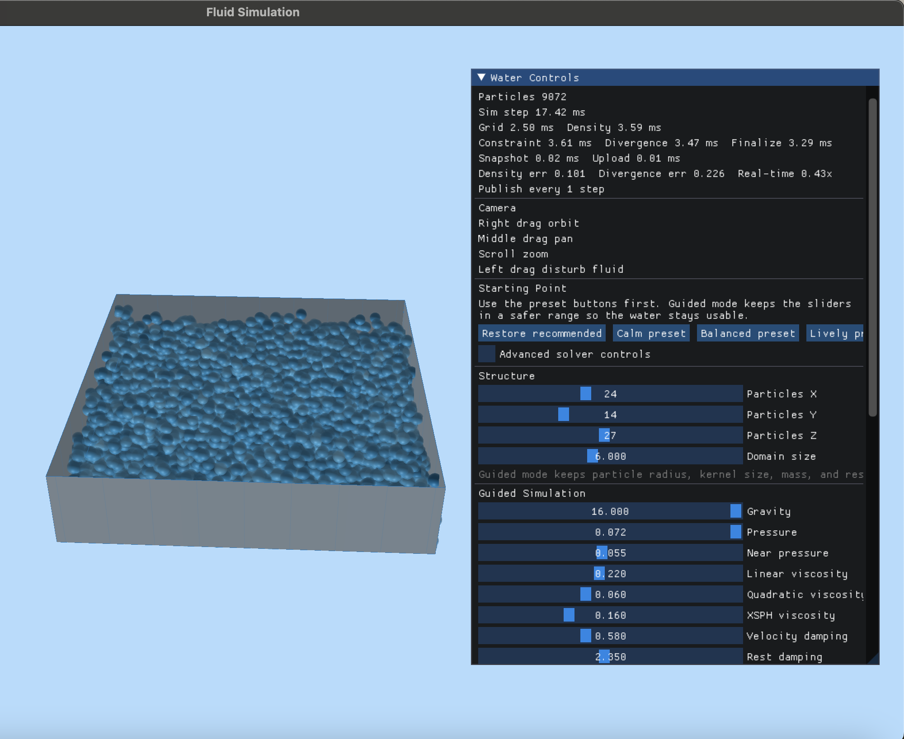

# Fluid Simulation

Real-time fluid simulation sandbox built with C++, CMake, GLFW, OpenGL, ImGui, and an optional Metal compute backend on macOS.

## What The App Does

- Simulates a particle-based volume of water in a bounded basin.
- Supports interactive disturbances with the mouse.
- Exposes live tuning controls for solver behavior, rendering, and backend selection.
- Publishes per-frame simulation stats for profiling and benchmarking.
- Supports a CPU path and a Metal path behind the same runtime interface.


## Build Layout

- `build/`: default local development build
- `build-perf/`: release-style benchmark build
- `build-release/`: production-oriented release build

## Source Layout

```text
include/
  app/        windowing, input, camera-facing interfaces
  platform/   Metal backend bridge
  render/     renderer-facing types and APIs
  sim/        simulation-facing types and APIs
  util/       GL and asset helpers
src/
  app/        app entrypoint and controls
  platform/   Metal backend implementation
  render/     OpenGL renderer implementation
  sim/        CPU simulation backend
  util/       shared helpers
resources/
  shaders/    OpenGL and Metal shader sources
docs/         app, implementation, optimization, and workflow notes
```


## Quick Start

Default development build:

```bash
cmake --preset default
cmake --build --preset default
./build/FluidSimulation
```

Performance build:

```bash
cmake --preset perf
cmake --build --preset perf
./build-perf/FluidSimulation
```


## Run Modes

Interactive CPU run:

```bash
./build/FluidSimulation
```

Interactive Metal run on macOS:

```bash
./build/FluidSimulation --metal
```

CPU benchmark:

```bash
./build-perf/FluidSimulation --benchmark
```

Metal benchmark:

```bash
./build-perf/FluidSimulation --benchmark --metal
```

Run a specific benchmark scene:

```bash
./build-perf/FluidSimulation --benchmark --benchmark-scene calm-rest
./build-perf/FluidSimulation --benchmark --benchmark-scene repeated-impulse
./build-perf/FluidSimulation --benchmark --benchmark-scene wall-slash
```

Available benchmark scenes are `steady-state`, `calm-rest`, `repeated-impulse`, `wall-slash`, and `all`.

## Documentation

- [App Functionality](./docs/APP_FUNCTIONALITY.md)
- [Implementation Notes](./docs/IMPLEMENTATION.md)
- [Optimization Routes](./docs/OPTIMIZATION_ROUTES.md)
- [Build and Workflow](./docs/BUILD_AND_WORKFLOW.md)

## Current Architecture

- CPU backend:
  Cell-reordered SoA particle storage, counting-sort uniform grid, threaded simulation worker, compact render snapshots.
- Metal backend:
  Metal compute kernels for integration, GPU grid scan, density/divergence solve stages, and finalization.
- Renderer:
  OpenGL point-sprite water rendering with compact per-particle metrics.
- UI:
  ImGui-driven controls for structure, solver tuning, quality policy, backend selection, and diagnostics.

